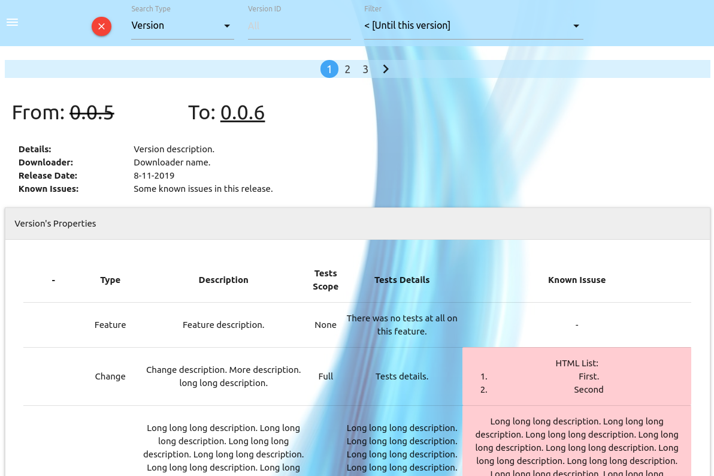
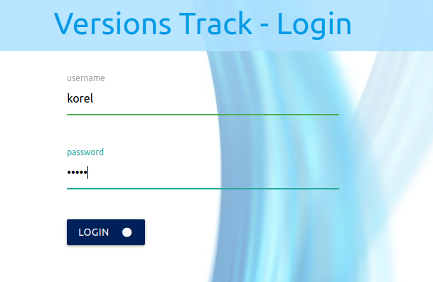
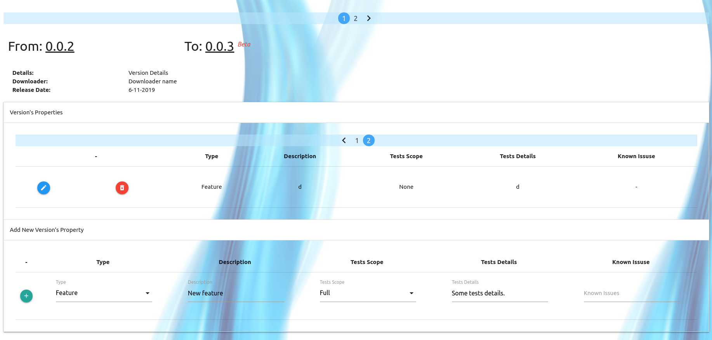
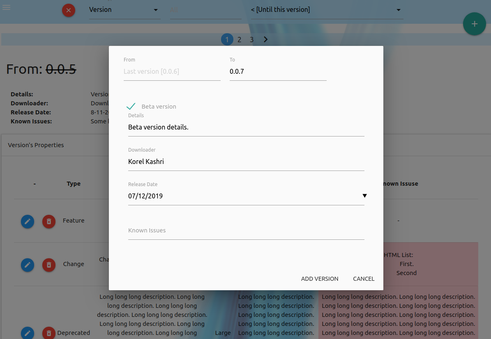
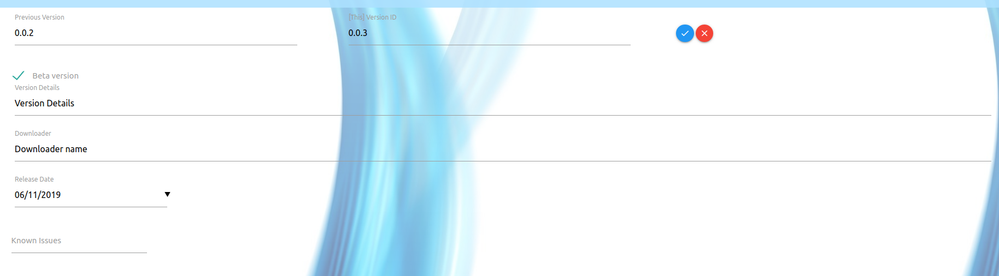
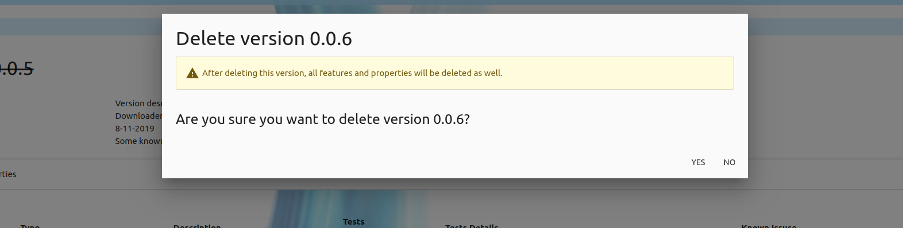
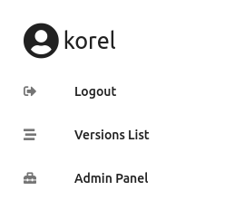
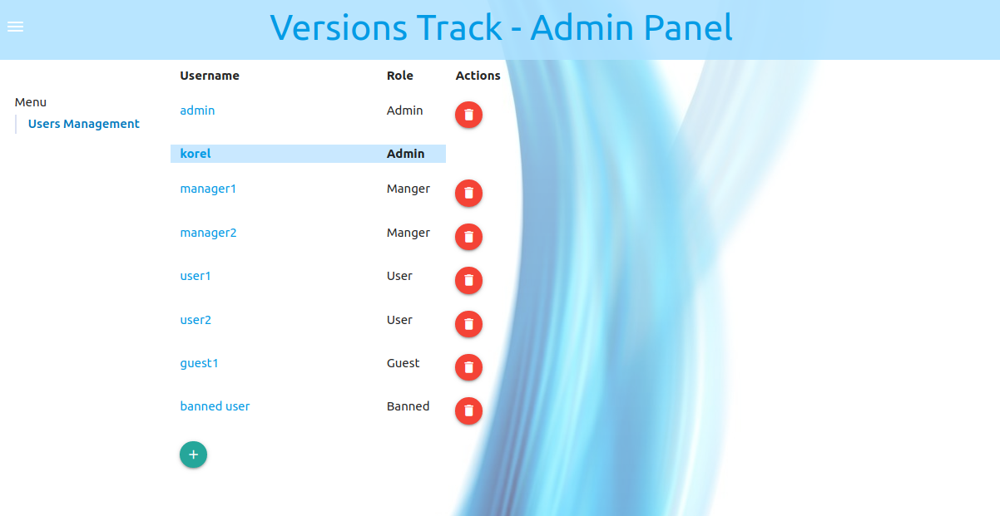
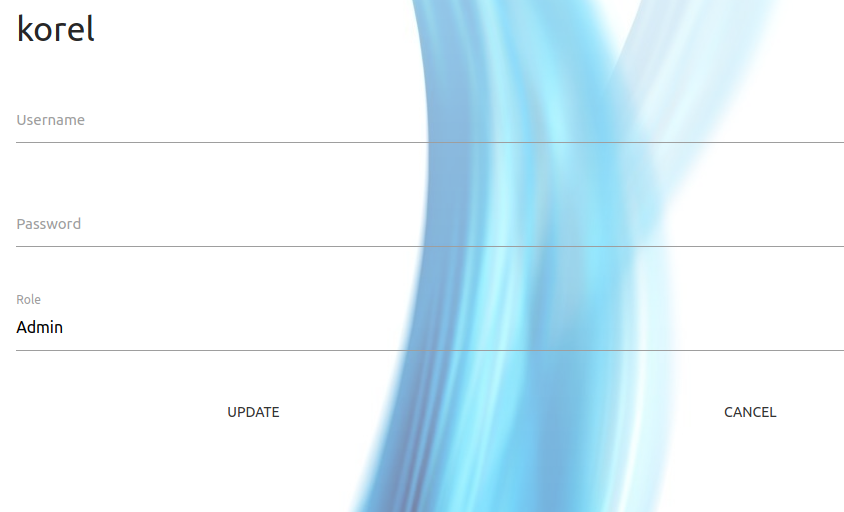
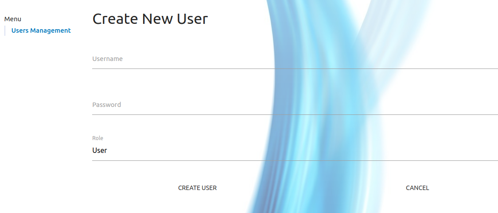

<!--[]()-->

# Versions Track
Web-based application for release versions management.

# Description
Interactive web-based application to control issues & features, alongside development.
Mark and remember old issues with versions/dates/description oriented search.

**Compatible with offline systems.**

Table of Contents
=================
   * [Versions Track](#versions-track)
   * [Description](#description)
   * [Table of Contents](#table-of-contents)
   * [Demo](#demo)
   * [Dependencies](#dependencies)
   * [Run](#run)
      * [Access Server](#access-server)
      * [Configuration](#configuration)
   * [Stabled Features](#stabled-features)
   * [Pictures](#pictures)
      * [Search section](#search-section)
      * [Guest Access](#guest-access)
         * [Versions Overview](#versions-overview)
         * [Login Page](#login-page)
      * [Manager Access](#manager-access)
         * [Versions Overview](#versions-overview-1)
         * [Add new version](#add-new-version)
         * [Modify version](#modify-version)
         * [Delete version](#delete-version)
      * [Side Navigation Bar](#side-navigation-bar)
      * [Admin Access](#admin-access)
         * [Admin Panel - Users Management](#admin-panel---users-management)
            * [View Users List](#view-users-list)
            * [Modify User](#modify-user)
            * [Create New User](#create-new-user)
   * [TODO](#todo)
      * [Next](#next)

# Demo
[demo - VersionsTrack](https://versions-track.herokuapp.com/)

# Dependencies
* [node.js](https://nodejs.org/en/).
* [mongodb](https://www.mongodb.com/).

# Run
```
sudo service mongod start # make sure to start mongodb service
node ./app.js
```

## Access Server
```
# On browser [chrome recommended]: localhost:5000
```

## Configuration
At the first time you run the system (v2.0.0+), admin user is automatically generated.
```
username: admin
password: admin
```
You can modify this user after login into it using ```Sidebar -> Admin Panel -> Users Management -> admin```

WARNING! Don't lose your admin user credentials.

# Stabled Features
* Versions basic identifiers: Previous version id, This version id (e.g. From: 3.0.0 To: 3.0.1).
* Beta versions marking.
* Version properties: Unique changes that applied in specific version (e.g. Features, Solved Bugs, etc..).
* Versions search by version-id, version release date, and versions/properties descriptions.
* Users privileges:
    * Admin    -> Full access + Admin panel access.
    * Manager  -> Create / Delete / Modify versions/properties access.
    * User     -> Watch access.
    * Guest    -> Watch access.
    * Banned   -> No access at all.
* Admin Panel:
    * Users control panel (Add / Modify / Remove).
* Easy to use web-based interface, designed with [MaterializeCSS](https://materializecss.com/)
* Compatible with offline systems.
* Cross-Platform application.

# Pictures

## Search section


## Guest Access
### Versions Overview


### Login Page


## Manager Access
### Versions Overview


### Add new version


### Modify version


### Delete version


## Side Navigation Bar


## Admin Access
### Admin Panel - Users Management
#### View Users List


#### Modify User


#### Create New User


# TODO
* *~~Limit versions count in a page.~~* :heavy_check_mark:
* *~~Limit properties count in a page.~~* :heavy_check_mark:
* *~~Beta version marking.~~* :heavy_check_mark:
* *~~Users privileges.~~* :heavy_check_mark:
* Order properties by type/tests scope.
* Add generic description options for versions.
* Properties/Versions short description TAGs.
* Edit profile:
    * Edit username/password.
    * Edit versions_in_page/properties_in_page.
    * Use user's versions_in_page/properties_in_page properties.
* Git integration.
    * Auto properties addition by git commits.
    * Define commit template, for property type detection.
        * For example:
            ```bash
                git commit -m " Untracked commit info...
                                ...
                                ...
                                *-Feature|Description|TestsScope|Tests Details|Known Issues*-
                                *-Change|Change Desc|FULL|Some T details-*
                                *-Deprecated|Details|NONE-*
                                ...
                                ...Untracked commit info...
                                ...
                                *-Feature|Details|PARTIAL|Details.-*
                                ...
                              "
          ```
    * Detect the latest checked commit, and follow the new ones [Every git refresh].

## Next
* Add discussion page for versions/properties.
* Multiple languages supporting.
* Users privileges:
    * User     -> Comment for issues in versions.
* Admin Panel:
    * Background change option.
* JetBrains integration.
* Manage multiple projects versions.
    * Separate access rules for users by projects.
    * Enable different git follow for each project.
* Changes log