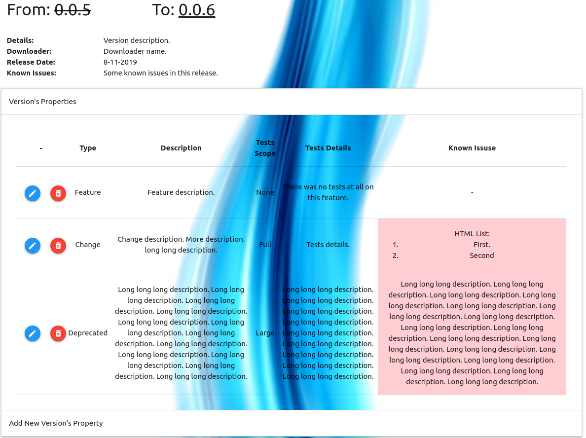
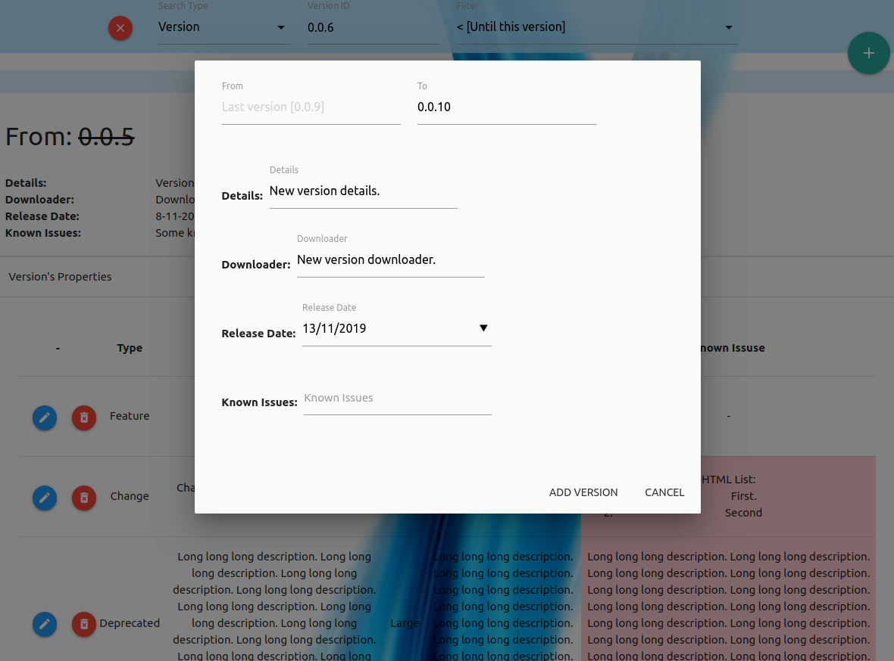
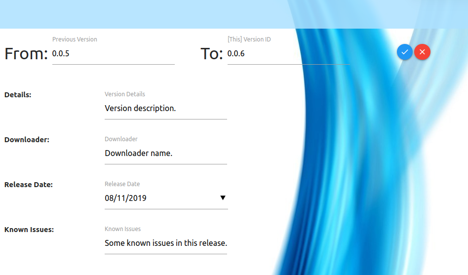

<!--[]()-->

# Versions Track
Web-based application for release versions management.

## Description
Interactive web-based application to control issues & features, alongside development.
Mark and remember old issues with versions/dates/description oriented search.

Table of Contents
=================
   * [Versions Track](#versions-track)
         * [Description](#description)
      * [Table of Contents](#table-of-contents)
         * [Demo](#demo)
         * [Dependencies](#dependencies)
         * [Run](#run)
            * [Access Server](#access-server)
            * [Configuration](#configuration)
         * [Stabled Features](#stabled-features)
         * [Pictures](#pictures)
            * [Versions Overview](#versions-overview)
            * [Search section](#search-section)
            * [Add new version](#add-new-version)
            * [Modify version](#modify-version)
            * [Modify version's property](#modify-versions-property)
            * [TODO](#todo)
               * [Next](#next)

**Compatible with offline systems.**

## Demo
[demo - VersionsTrack](https://versions-track.herokuapp.com/)

## Dependencies
* [node.js](https://nodejs.org/en/).
* [mongodb](https://www.mongodb.com/).

## Run
```
sudo service mongod start # make sure to start mongodb sevice
node ./app.js
```

### Access Server
```
# On browser [chrome recommanded]: localhost:5000
```

### Configuration
At the first time you run the system (v2.0.0+), admin user is automatically generated.
```
username: admin
password: admin
```
You can modify this user after login into it using ```Sidebar -> Admin Panel -> Users Management -> admin```

WARNING! Don't lose your admin user credentials.

## Stabled Features
* Versions basic identifiers: Previous version id, This version id (e.g. From: 3.0.0 To: 3.0.1).
* Beta versions marking.
* Version properties: Unique changes that applied in specific version (e.g. Features, Solved Bugs, etc..).
* Versions search by version-id, version release date, and versions/properties descriptions.
* Users privileges:
    * Admin    -> Full access + Admin panel access.
    * Manager  -> Create / Delete / Modify versions/properties access.
    * User     -> Watch access.
    * Guest    -> Watch access.
    * Banned   -> No access at all.
* Admin Panel:
    * Users control panel (Add / Modify / Remove).
* Easy to use web-based interface, designed with [MaterializeCSS](https://materializecss.com/)
* Compatible with offline systems.
* Cross-Platform application.

## Pictures
### Versions Overview


### Search section


### Add new version


### Modify version


### Modify version's property


### TODO
* *~~Limit versions count in a page.~~* :heavy_check_mark:
* *~~Limit properties count in a page.~~* :heavy_check_mark:
* *~~Beta version marking.~~* :heavy_check_mark:
* *~~Users privileges.~~* :heavy_check_mark:
* Order properties by type/tests scope.
* Add generic description options for versions.
* Properties/Versions short description TAGs.
* Edit profile:
    * Edit username/password.
    * Edit versions_in_page/properties_in_page.
    * Use user's versions_in_page/properties_in_page properties.

#### Next
* Add discussion page for versions/properties.
* Multiple languages supporting.
* Users privileges:
    * User     -> Comment for issues in versions.
* Admin Panel:
    * Background change option.
* JetBrains/Git integration.