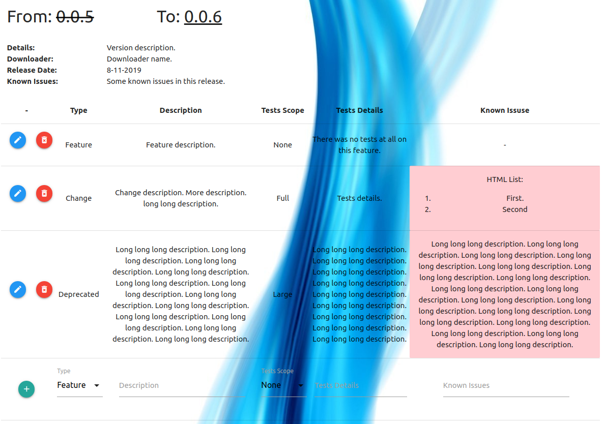
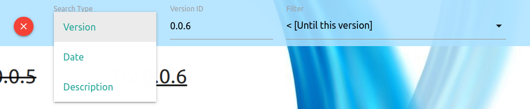
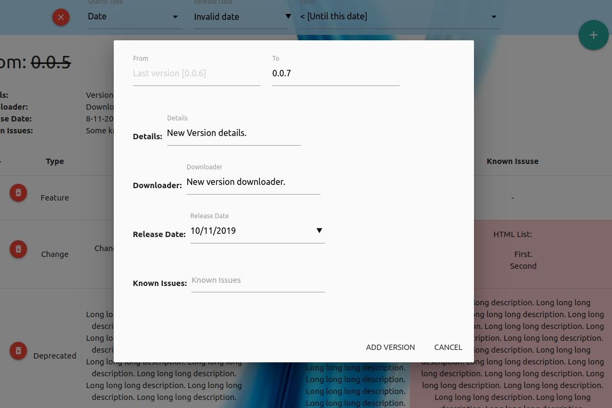
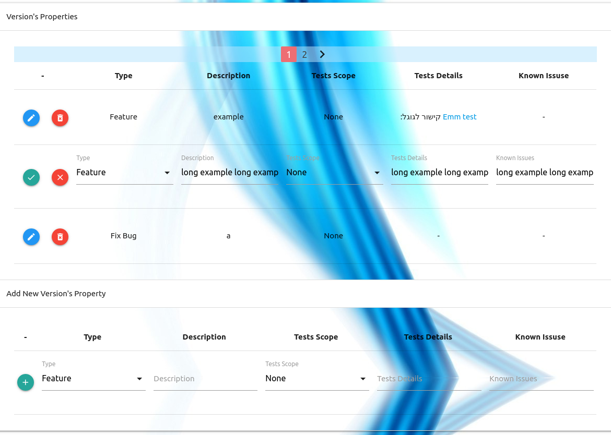

# Description
Interactive web-based application to control issues & features, alongside development.
Mark and remember old issues with versions/dates/description oriented search.

**Compatible with offline systems.**

# Dependencies
* [node.js](https://nodejs.org/en/).
* [mongodb](https://www.mongodb.com/).

# Run
```
sudo service mongod start # make sure to start mongodb sevice
node ./app.js
```

# Features
* Versions basic identifiers: Previous version id, This version id (e.g. From: 3.0.0 To: 3.0.1)
* Version properties: Unique changes that applied in specific version (e.g. Features, Solved Bugs, etc..)
* Easy to use web-based interface, designed with [MaterializeCSS](https://materializecss.com/)
* Versions search by version-id, version release date, and versions/properties descriptions.
* Compatible with offline systems.
* Cross-Platform application.

## Pictures









## Upcoming features
* Order properties by type/tests scope.
* Add generic description options for versions.
* Limit versions count in a page.
* Limit properties count in a page.
* Properties/Versions short description TAGs.

### Next
* Add users privileges.
* Add admin panel.
    * Users control panel
    * Background change option.
